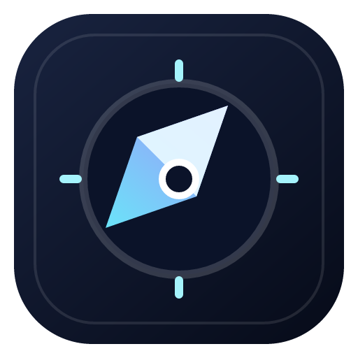
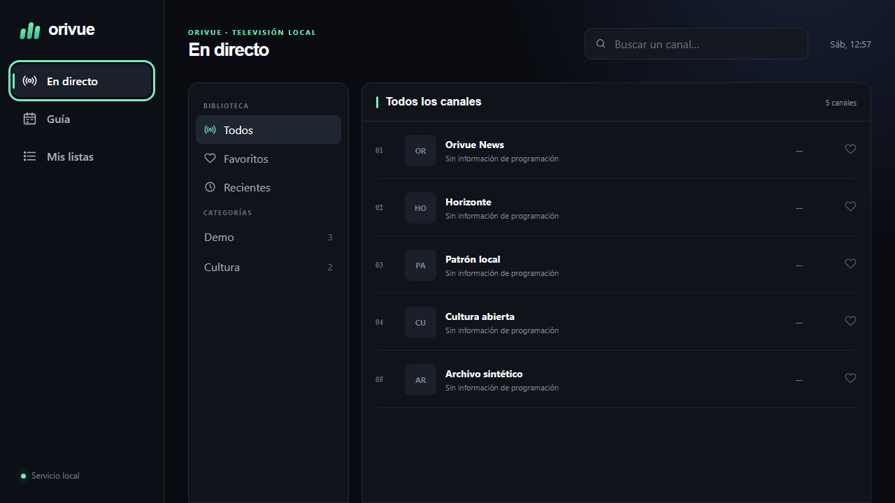

# Orivue

<p align="center">
  
</p>

Orivue es un reproductor y organizador IPTV local-first, libre y pensado para
televisión. Importa fuentes M3U/M3U8 autorizadas por el usuario, organiza
canales y reproduce HLS desde una interfaz React manejable con teclado, ratón o
mando. No proporciona canales, listas, suscripciones ni contenido.



> **Nombre provisional:** “Orivue” puede cambiar antes de 1.0. No existe
> afiliación con TiviMate, Ace Stream ni sus fabricantes.

## Estado actual

La rama de desarrollo corresponde a `0.1.0`, una **preversión**. El MVP se está
validando antes de una publicación estable:

| Área                                                  | Estado                                                                         |
| ----------------------------------------------------- | ------------------------------------------------------------------------------ |
| Monorepo TypeScript, parser M3U, servicio local y web | Implementado en código                                                         |
| Listas, grupos, búsqueda, favoritos y recientes       | Implementado en código                                                         |
| Reproducción HLS y fixtures legales                   | Implementado; depende de compatibilidad del stream/navegador                   |
| XMLTV/EPG                                             | Implementado en el alcance descrito en el changelog                            |
| Ace Stream                                            | Adaptador opcional; validación simulada, no validado con un motor físico       |
| Tauri 2                                               | Configurado; sidecar Windows probado, build nativo pendiente por falta de MSVC |
| GitHub Actions y releases                             | Configurados; no ejecutados hasta publicar el repositorio                      |
| Firma de instaladores                                 | No configurada                                                                 |

Consulta [CHANGELOG.md](CHANGELOG.md) para el alcance exacto y las limitaciones
conocidas. Un elemento presente en el código no debe interpretarse como
validado en todas las plataformas.

## Principios

- **Local-first y privado:** base de datos y preferencias permanecen en el
  equipo; no hay telemetría por defecto.
- **Seguro por defecto:** API en `127.0.0.1`, origen controlado, credenciales
  redactadas y proxy limitado a streams de listas importadas.
- **Escalable:** importación incremental, SQLite indexado y listas virtualizadas.
- **Extensible:** resolutores HLS, HTTP y Ace Stream separados.
- **Legal:** Orivue solo se debe usar con fuentes y emisiones que el usuario
  tenga derecho a reproducir.

## Requisitos

- Node.js 22 o posterior (la versión recomendada está en `.nvmrc`).
- Corepack y pnpm 11.9.0.
- Para escritorio: [prerrequisitos de Tauri 2](https://v2.tauri.app/start/prerequisites/),
  Rust estable y las bibliotecas nativas de la plataforma.

```bash
corepack enable
pnpm install --frozen-lockfile
```

Conserva `pnpm-lock.yaml` en los commits para instalaciones reproducibles.

## Desarrollo

Desde la raíz:

```bash
pnpm install
pnpm dev
```

La web usa normalmente `http://localhost:5173` y la API solamente loopback. Los
puertos efectivos aparecen en la salida de desarrollo. Para ejecutar piezas
por separado:

```bash
pnpm --filter @orivue/server dev
pnpm --filter @orivue/web dev
```

No pegues en capturas, terminales compartidos o issues URLs de listas: a menudo
incluyen usuario, contraseña o token en el query string.

## Primera prueba con datos ficticios

1. Arranca servicio y web con `pnpm dev`.
2. Abre la dirección que muestra Vite.
3. Importa `fixtures/sample.m3u` si la interfaz admite archivo, o sirve la
   carpeta `fixtures` por HTTP local y usa su URL.
4. Selecciona un canal de demostración y comprueba los estados del reproductor.
5. Si cargas la guía, utiliza `fixtures/sample.xml`.

Los fixtures del repositorio son sintéticos. Orivue no descarga listas públicas
de Internet ni comprueba masivamente los canales durante una importación.

## Importar M3U/M3U8

En **Listas → Añadir lista**, asigna un nombre y proporciona una URL HTTPS/HTTP
autorizada o un archivo local cuando esa opción esté disponible. Una
actualización válida sustituye la versión anterior de forma transaccional; si
falla, la versión útil previa se conserva. Los identificadores estables ayudan
a mantener favoritos y personalizaciones.

La aplicación interpreta `#EXTM3U`, `#EXTINF`, `tvg-id`, `tvg-name`,
`tvg-logo`, `group-title` y encabezados representables de forma segura. Las
entradas defectuosas se aíslan y se notifican sin convertir los datos restantes
en válidos automáticamente.

## XMLTV y EPG

Añade la URL XMLTV desde la configuración de guía. La asociación principal usa
`tvg-id`; la coincidencia por nombre es una alternativa prudente y puede
corregirse manualmente. Fechas XMLTV se normalizan conservando su zona horaria.
Fuentes enormes o no confiables están sujetas a límites de tamaño y tiempo.

## Ace Stream opcional

Orivue funciona sin Ace Stream. Si ya tienes un motor compatible instalado:

1. Configura su endpoint **local** en Ajustes → Integraciones.
2. Comprueba el estado antes de abrir un canal `acestream://`.
3. Orivue solicitará una URL HTTP local y cerrará la sesión al cambiar de canal.

Orivue no incluye, descarga ni redistribuye Ace Stream Engine. El adaptador no
elude DRM, autenticación, pagos ni controles de acceso. En esta versión se ha
probado con dobles/simuladores; la interoperabilidad con instalaciones reales
queda pendiente de validación física.

## Calidad y build de producción

```bash
pnpm format:check
pnpm lint
pnpm typecheck
pnpm test
pnpm build
pnpm verify
```

`pnpm verify` no incluye automáticamente pruebas E2E que requieran navegador:

```bash
pnpm test:e2e
```

No interpretes la mera existencia de estos comandos como un resultado exitoso;
los resultados ejecutados se informan en la entrega o en GitHub Actions.

## Escritorio con Tauri 2

Instala primero los prerrequisitos de Tauri y luego:

```bash
pnpm --filter @orivue/desktop desktop:dev
pnpm --filter @orivue/desktop desktop:build
```

Windows es la plataforma inicial. Linux y macOS se consideran experimentales.
El build de distribución requiere preparar el servicio como sidecar nativo;
consulta [apps/desktop/README.md](apps/desktop/README.md). El proceso de release
crea artefactos sin firma: Windows SmartScreen y los mecanismos equivalentes
pueden advertir al usuario.

El sidecar Windows se empaquetó y respondió a `/api/health` con token efímero.
Rust 1.97.1 generó y fijó `Cargo.lock`; `cargo check` alcanzó la compilación de
dependencias y se detuvo porque falta el linker `link.exe` de MSVC. Por tanto,
la capa Rust y el instalador siguen pendientes de validación nativa.

## Arquitectura

```text
apps/web (React + Vite)
        │ contratos tipados / token efímero
        ▼
apps/server (Fastify, solo 127.0.0.1)
        ├── SQLite y migraciones
        ├── importadores M3U/XMLTV
        ├── proxy de sesiones restringido
        └── resolutores HLS / HTTP / Ace opcional
        ▲
apps/desktop (Tauri 2, supervisa el servicio empaquetado)

packages/* (dominio, parsers, reproductor y contratos compartidos)
```

Las decisiones y límites están en [docs/architecture.md](docs/architecture.md),
[docs/api.md](docs/api.md) y [docs/adr](docs/adr).

## Privacidad y seguridad

- El servicio escucha exclusivamente en loopback por defecto; no habilites LAN.
- Solo se permiten orígenes locales previstos y sesiones autenticadas.
- El proxy no acepta un destino remoto libre: deriva destinos de canales
  importados y sesiones vigentes.
- URLs y cabeceras sensibles se redactan en logs y diagnósticos.
- No hay telemetría ni sincronización remota por defecto.
- La base SQLite contiene metadatos y puede contener URLs secretas; protege tu
  cuenta de usuario y no compartas el archivo.

Lee el [modelo de amenazas](docs/security-model.md) y [SECURITY.md](SECURITY.md).
Una interfaz loopback reduce la exposición, pero no equivale a una frontera de
confianza absoluta frente a malware local o a una cuenta comprometida.

## Solución de problemas

**La lista no se importa.** Comprueba que la URL sea accesible desde el mismo
equipo, que devuelva M3U y que no haya expirado. No publiques la URL completa.
Revisa los límites de descarga y las redirecciones.

**La web dice que la API no está disponible.** Inicia `@orivue/server`, confirma
el puerto mostrado y descarta otro proceso ocupándolo. No cambies el bind a
`0.0.0.0` como solución rápida.

**El canal no reproduce.** HLS puede fallar por codec, CORS del proveedor, token
caducado o disponibilidad del origen. Prueba el fixture local para separar un
problema de Orivue de uno del proveedor.

**No aparece EPG.** Verifica `tvg-id`, rango temporal, zona horaria y fecha de la
última actualización. La coincidencia por nombre es deliberadamente cauta.

**Ace Stream aparece desconectado.** El motor es externo: confirma que está
encendido y que el endpoint configurado es loopback. Orivue no lo instala.

**Tauri no compila.** Ejecuta `rustc --version`, instala los prerrequisitos de
Tauri 2 y comprueba que el sidecar esperado exista. Consulta el README de
escritorio para los nombres por target triple.

## Limitaciones conocidas

- El nombre público aún no es definitivo.
- No hay ejecutables firmados ni notarizados.
- El build Tauri nativo de Windows requiere instalar MSVC Build Tools con la
  carga de C++; el sidecar sí está validado de forma independiente.
- El runtime Node 22 incluido usa `node:sqlite`, aún marcado como experimental
  por Node; se revisará su estabilidad antes de 1.0.
- Windows es el único objetivo de soporte inicial; otros sistemas requieren
  validación real.
- Ace Stream no se ha validado con un motor físico en el entorno inicial.
- Los proveedores controlan codecs, CORS y disponibilidad; Orivue no puede
  garantizar que un stream autorizado sea reproducible.
- El almacenamiento de secretos depende de las protecciones de la cuenta local;
  el cifrado con almacenes nativos se mantiene en el roadmap.

## Roadmap

- **v0.1:** monorepo, M3U, grupos, búsqueda, favoritos/recientes, HLS, servicio
  loopback, fixtures, tests y CI.
- **v0.2:** XMLTV completo, ahora/después, guía temporal y personalización.
- **v0.3:** API estable de resolutores, Ace Stream opcional y diagnósticos.
- **v0.4:** Tauri pulido, mando, instaladores, accesibilidad y rendimiento.
- **1.0:** nombre e interfaces estables, builds firmados y matriz de plataformas
  validada.

El orden puede cambiar según resultados de seguridad y pruebas.

## Contribuir

Se agradecen issues y pull requests. Empieza por [CONTRIBUTING.md](CONTRIBUTING.md)
y [docs/good-first-issues.md](docs/good-first-issues.md). No se exige CLA: al
contribuir aceptas publicar tu aportación bajo la licencia MIT del proyecto.

## Uso responsable y licencia

Utiliza Orivue exclusivamente con listas, canales y emisiones que hayas creado,
que sean de dominio público o para las que tengas autorización. El usuario es
responsable de cumplir las leyes y condiciones aplicables. No solicites ayuda
para eludir DRM, pagos, autenticación o restricciones de acceso.

Código publicado bajo [licencia MIT](LICENSE). Copyright (c) 2026 Jaime and
contributors.
